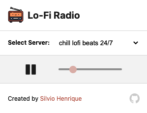

# Lo-Fi Radio 
> Simple Chrome Extension to provide you a good ambient sound!

[](https://forthebadge.com) [](https://forthebadge.com) \
 



## Getting Started
Clone the repo:
``` 
$ git clone https://github.com/silviohfc/lofi-radio
```
It's actually using **JSONbin** as the JSON host for radio data, you can create your own data like that:
``` 
{
    "name": "<radio name>",
    "src": "<stream link>"
}
```
Then you will need edit ```app/backgrounds.js```, inside the file exists the method called ```getStationsJSON```, just change de url to your JSON link and the key if it's a private one.


## License
Distributed under the MIT License. See ```LICENSE``` for more information.